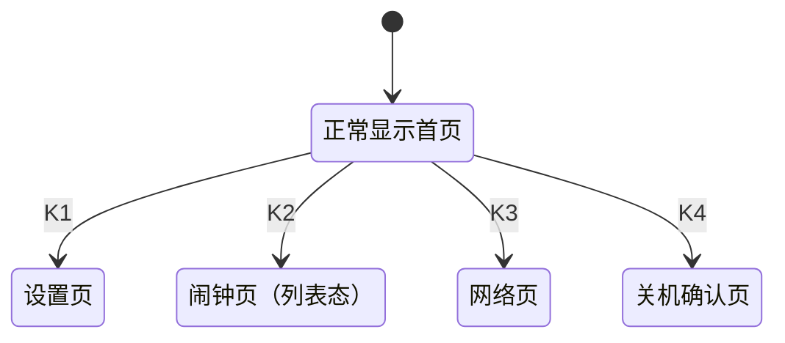
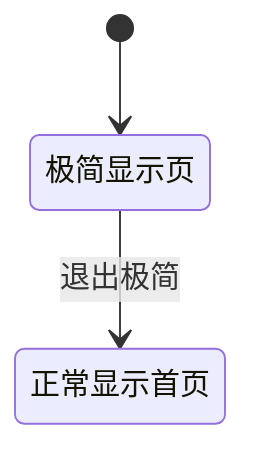
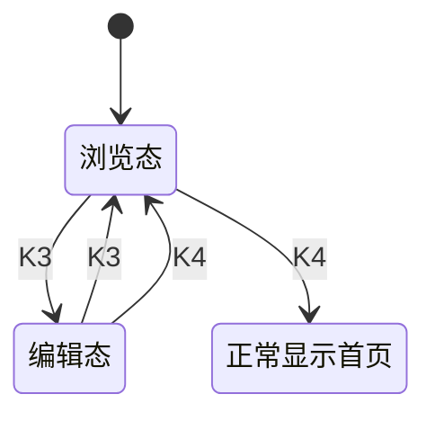
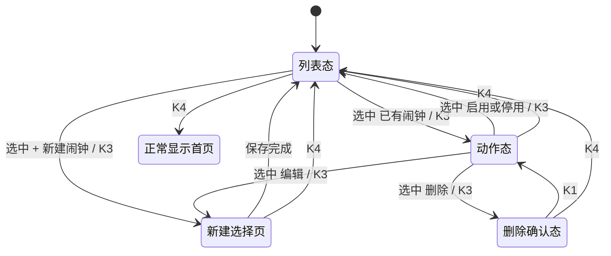
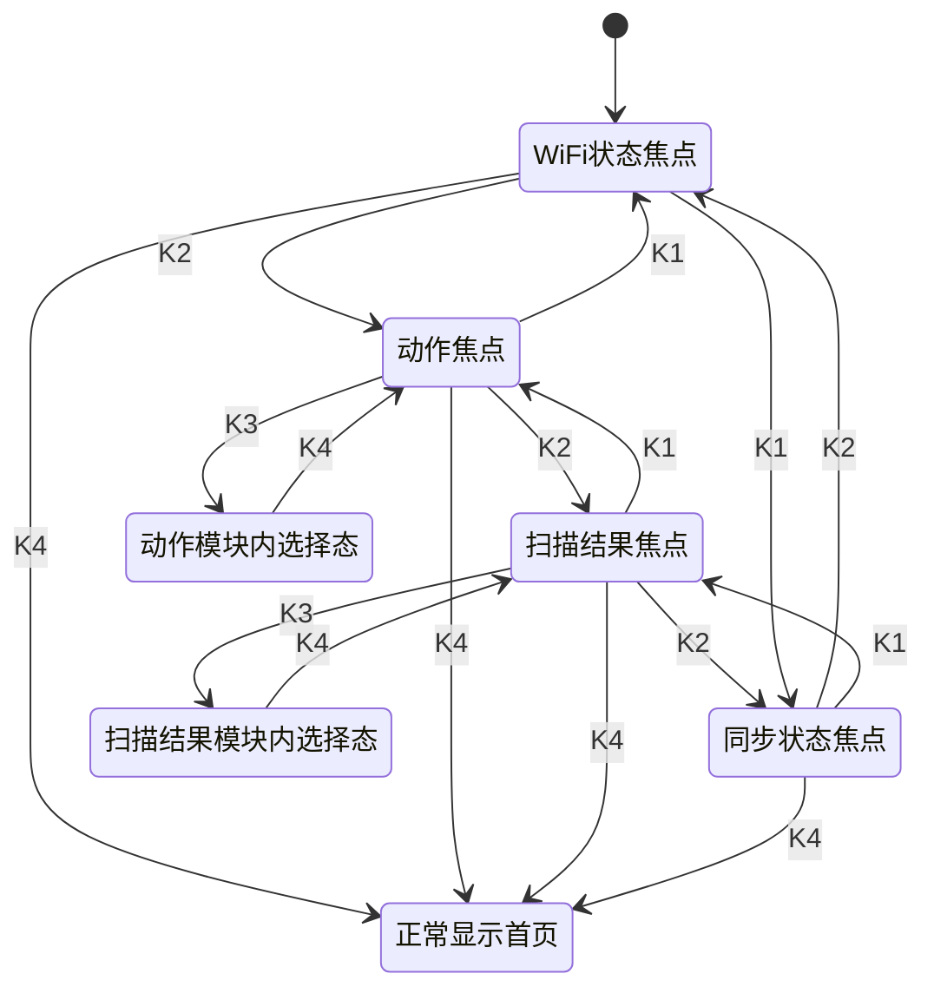
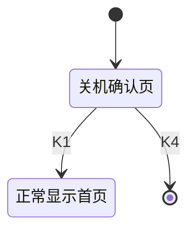

# 智能闹钟 UI 设计文档

## 1. 文档范围
- 屏幕规格：`240x320` 竖屏
- 文档内容：静态页面结构、页面元素、按键功能标注
- 页面集合：正常显示首页、极简显示页、设置页、闹钟页（列表态）、闹钟页（新建选择页）、网络页、关机确认页

---

## 2. 页面总览（静态缩略）

### 2.1 正常显示首页

  

    

      
2026-05-15 FRI

      
19:30:08

    

    

      
声音ON

      
语音OFF

    

  

  

    温 26C湿 58%光 320
  

  

    Tips
    环境光偏低，建议开灯
  

  

    
闹钟07:30

    
REPEAT

  

  

    
Todo List

    
1. 取快递

    
2. 提交周报

    
+4

  

  

    设置闹钟网络关机
  

### 2.2 极简显示页

  
19:30

### 2.3 设置页

  
设置

  

    
SOUNDON

    
AUDIOOFF

    
VOLUME6

    
ENV SAMPLE5s

    
REPEAT2

  

  

    上移下移选择返回
  

### 2.4 闹钟页（列表态）

  
闹钟

  

    

      
+ 新建闹钟

      
07:30 MON WED FRI

      
08:00 DAILY

      
20:15 ONCE

    

    

      
详情

      
07:30

      
MON WED FRI

      
REPEAT / ENABLED

    

  

  

    上移下移选择返回
  

### 2.5 闹钟页（新建闹钟选择页）

  
闹钟新建

  

    
时08

    
分00

    
秒00

    
星期方案工作日

    
重复ON

    
启用ON

  

  

    上移下移选择返回
  

### 2.6 网络页（模块选择态）

  
网络

  

    

      

        
WiFi状态

        
Connected

        
Home-2.4G

        
192.168.1.72

      

      

        
扫描结果

        
Home-2.4G

        
Office-5G

        
Lab-AP01

      

    

    

      

        
动作

        
扫描

        
断开

        
校时

        
同步Todo

      

      

        
同步状态

        
TIME OK

        
TODO OK

        
19:25:10

      

    

  

  

    上移下移选择返回
  

### 2.7 关机确认页

  
关机确认

  

    
确认关机？

    
再次确认后关闭系统

  

  

    返回--确认
  

---

## 3. 页面元素说明

### 3.1 正常显示首页
- 时间区：日期、星期、时分秒
- 状态区：声音、语音（`ON/OFF`）
- 环境区：温度、湿度、光照
- Tips 区：单条提示语
- 闹钟区：最近闹钟时间、重复标记
- Todo 区：固定 2 条，超出显示 `+N`
- 底栏：`设置 / 闹钟 / 网络 / 关机`

### 3.2 极简显示页
- 居中显示当前时间

### 3.3 设置页
- 列表项：`SOUND`、`AUDIO`、`VOLUME`、`ENV SAMPLE`、`REPEAT`

### 3.4 闹钟页
- 列表区：`+ 新建闹钟` 与已有闹钟
- 详情区：当前选中项摘要
- 编辑字段：时、分、秒、星期方案、重复、启用
- 删除确认：确认文案与当前闹钟摘要

### 3.5 闹钟页（新建闹钟选择页）
- 字段列表：时、分、秒、星期方案、重复、启用
- 单字段高亮：当前可调整项

### 3.6 网络页
- 模块：`WiFi状态`、`动作`、`扫描结果`、`同步状态`
- 扫描结果：静态展示 3 条
- 动作项：`扫描`、`断开`、`校时`、`同步Todo`

### 3.7 关机确认页
- 关机确认文案

---

## 4. 按键功能标注

### 4.1 首页
| 实体按键 | 功能 |
| --- | --- |
| K1 | 设置 |
| K2 | 闹钟 |
| K3 | 网络 |
| K4 | 关机 |

### 4.2 设置页 / 闹钟页 / 网络页（统一）
| 实体按键 | 功能 |
| --- | --- |
| K1 | 上移 |
| K2 | 下移 |
| K3 | 选择 |
| K4 | 返回 |

### 4.3 关机确认页
| 实体按键 | 功能 |
| --- | --- |
| K1 | 返回 |
| K2 | - |
| K3 | - |
| K4 | 确认 |

---

## 5. 默认状态与状态转移

### 5.1 正常显示首页
- 默认状态：正常显示首页

### 5.2 极简显示页
- 默认状态：居中时间显示

### 5.3 设置页
- 默认状态：浏览态
- 默认焦点控件：`SOUND`
- 焦点顺序：`SOUND -> AUDIO -> VOLUME -> ENV SAMPLE -> REPEAT -> SOUND`

### 5.4 闹钟页
- 默认状态：列表态
- 默认焦点控件：`+ 新建闹钟`

### 5.5 网络页
- 默认状态：模块选择态
- 默认焦点控件：`WiFi状态`
- 模块顺序：`WiFi状态 -> 动作 -> 扫描结果 -> 同步状态 -> WiFi状态`

### 5.6 关机确认页
- 默认状态：关机确认页

---

## 6. 静态 HTML 组织规范（用于后续 LVGL 转写）
- 每个页面以 `240x320` 单容器表示
- 页面分为：标题区、内容区、按键标注区
- 内容区内部使用固定像素块布局，不依赖脚本、不依赖外部 CSS
- 颜色与字号使用明确常量，不使用动态主题切换
- 所有预览均为静态 HTML，无 JS 交互
